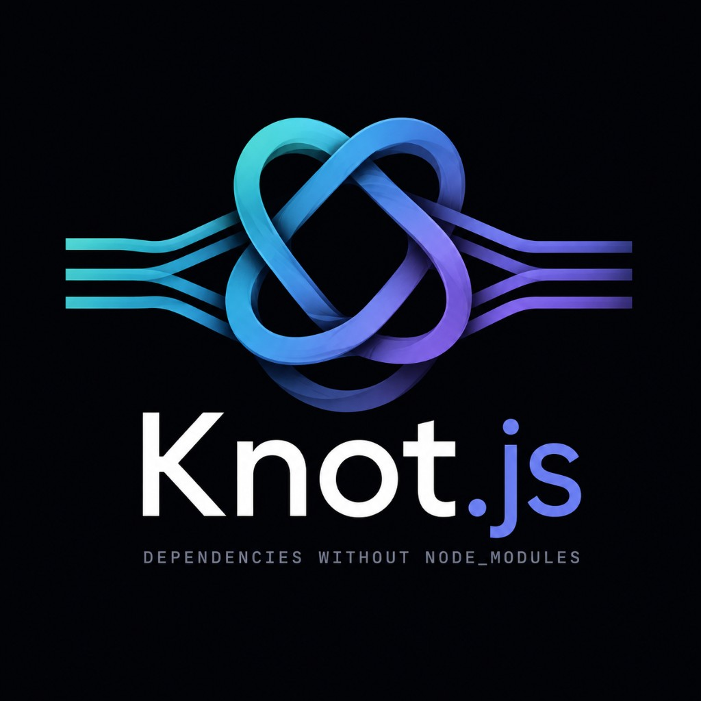

<p align="center">
  
</p>

<p align="center">
  Knot is an experimental content-addressed dependency execution framework for JavaScript and TypeScript.
</p>

<p align="center">
  <a href="https://github.com/theworker02/Knot.js/actions/workflows/ci.yml"></a>
  <a href="https://theworker02.github.io/Knot.js/"></a>
  <a href="LICENSE"></a>
</p>

---

Knot challenges one of the oldest assumptions in the Node.js ecosystem: that an entire dependency tree must be installed into a project-local `node_modules/` directory before a program can run.

```text
declare → resolve → verify → store → execute
              ↕
     retrieve when necessary
              ↕
     share immutable content
```

**Status:** 0.3 experimental. Nested packages, CommonJS `require`, `#imports`, `workspace:` members, developer lock signatures, and attestation verification are tested. A live npm corpus exists; the compatibility surface is still incomplete. Read the [compatibility matrix](docs/compatibility.md) before using Knot on a production application.

This README is a first read, not the manual. Deep pages live under [`docs/`](docs/introduction.md).

## What Knot is

Knot is a **dependency execution** system. A project declares the packages it is allowed to use. Knot then:

1. Resolves those names against `knot.lock` and the configured registry (npm today).
2. Retrieves missing artifacts only when they are needed, or when you snapshot them.
3. Verifies size, integrity, and content address before anything is executed.
4. Stores immutable objects in a global content store (`~/.knot` by default).
5. Executes the program through a Node.js loader — without a project-local `node_modules/`.

The same verified bytes can be reused by every Knot project on the machine. Cache presence is never treated as proof of integrity: objects are re-hashed before execution.

See [Why Knot?](docs/why-knot.md) and [concepts](docs/concepts.md).

## What Knot is not

- **Not a drop-in npm clone.** It does not recreate hoisting, plugins, or patch workflows. Unsupported cases fail with a `KNOT_*` code and a hint — not a silent fallback.
- **Not 1.0.** Compatibility is evidenced by tests, not hoped for on a marketing page. See [ROADMAP.md](ROADMAP.md).
- **Not a sandbox.** Verified bytes can still be malware. Knot makes substitution, corruption, and surprise install scripts difficult. It does not decide that JavaScript is trustworthy.
- **Not a publisher-identity system by default.** A matching content hash means the bytes are the bytes. It does not mean the publisher is who you think they are. See [attestations](docs/attestations.md) and [THREAT_MODEL.md](THREAT_MODEL.md).
- **Not lock-in.** `knot eject` writes conventional `package.json` + `node_modules/` where feasible. `knot migrate` reads existing lock metadata and never rewrites it.

## How it works

```text
                    KNOT
Application ──→ Resolver ──→ Execution
                   │
          ┌────────┴────────┐
          ↓                 ↓
    Content Store      Package Sources
          ↑
          │
     Shared Cache
```

1. **Declare.** `package.json` remains the source of names, versions, and dependencies. `knot.toml` holds Knot-specific policy: mode, integrity, offline, script allowlists, workspace members. You do not copy the dependency list into `knot.toml`.
2. **Resolve.** Resolution is parent-aware. When `parent-pkg` imports `child-pkg`, Knot uses `parent-pkg`'s declared range — not a hoisted tree and not the application’s dependency list. Undeclared imports fail with `KNOT_UNDECLARED_DEPENDENCY`. Details: [resolution](docs/resolution.md).
3. **Verify.** Every downloaded object passes size checks, npm `dist.integrity` when present, content addressing, and metadata before an atomic insert. Partially written artifacts are never executed.
4. **Store.** Objects live under `~/.knot` (`KNOT_STORE` overrides). Writes go to `tmp/` and are renamed into place. Projects register reachable objects so garbage collection cannot delete live content. Details: [content store](docs/content-store.md).
5. **Execute.** A Node customization hook intercepts bare specifiers and returns a `file:` URL into the unpacked content-addressed directory. There is no project-local `node_modules/`.

Traditional install:

```text
project
└── node_modules
    ├── dependency
    ├── dependency
    └── thousands more files
```

Knot:

```text
project
│
└──────────────┐
               ↓
         Content Graph
               ↓
          ~/.knot/store
          ↙     ↓     ↘
      Project Project Project
```

The full data-flow note is [ARCHITECTURE.md](ARCHITECTURE.md).

## Install

Requires **Node.js 20.10+**. TypeScript entrypoints (`knot run file.ts`) need **Node.js 22.6+** (type stripping). CommonJS `require` coverage uses Node customization hooks on **20.10+**.

```bash
npm install -g knotjs
```

Without a global install:

```bash
npx knotjs --help
```

The global store defaults to `~/.knot`. Override with `KNOT_STORE`. See [installation](docs/installation.md).

## 60-second example

```bash
npm install -g knotjs
knot init
knot run src/index.ts
```

`knot init` creates `knot.toml` and a starter entry. Add a dependency only when the program is allowed to use it:

```bash
knot add zod
knot run src/index.ts
```

Inspect and explain it:

```bash
knot inspect zod
knot why zod
```

There is no project-local `node_modules/` directory. Verified artifacts live in the global content store and are reused across projects.

Prepare a machine that must not use the network:

```bash
knot snapshot
knot run src/index.ts --offline --frozen
```

Leave Knot:

```bash
knot eject
```

More of the same path: [quick start](docs/quick-start.md).

## Project layout

A Knot project is a directory with policy and a lock — not a local install tree.

```text
my-app/
├── knot.toml          # Knot policy (mode, integrity, scripts, workspaces)
├── knot.lock          # Resolved graph, integrity, object ids, lockDigest
├── package.json       # Names, versions, dependencies, imports (when present)
├── src/index.ts
└── .knot/lock.pub     # Optional developer lock public key
```

There is no `node_modules/`. The store is global:

```text
~/.knot/
├── objects/           # Immutable content-addressed bytes
├── metadata/
├── unpacked/          # Extracted packages the loader points at
├── indexes/projects/  # Reachable objects per project (GC safety)
├── keys/lock.ed25519  # Default developer lock private key
└── …
```

`knot.toml` looks like this (from the hello-world example):

```toml
[project]
name = "hello-world"
version = "0.1.0"
runtime = "node"

[dependencies]

[knot]
mode = "lazy"
integrity = "strict"
offline = false

[security.scripts]
default = "deny"
allow = []
```

`knot.lock` is TOML, sorted, and diffable. A package entry records name, version, source, integrity, and content identity:

```toml
lockVersion = 1

[[package]]
name = "zod"
version = "4.0.0"
source = "npm"
integrity = "sha512-…"
object = "sha256:…"
```

The lock also records `lockDigest` (a SHA-256 of the canonical package list) and, optionally, a developer `lockSignature`. See [lockfiles](docs/lockfiles.md).

## Content addressing

An executable dependency is identified by cryptographic content, not merely `name@version`:

```text
sha256:8c23…e4a1
```

Identity in Knot:

```text
content identity  = hash(bytes)
package identity  = name + version + source + integrity + content identity
native identity   = package identity + os + arch + abi
```

If two projects require identical bytes, Knot stores those bytes once. If a cached object does not re-hash to its address, it is not executed.

Native addons include OS, architecture, and ABI in their identity. An artifact built for another platform is rejected rather than reused.

## Lazy execution

Bare specifiers are resolved when the runtime encounters them. Transitive dependencies are not materialized just because they appear in someone else's `package.json`.

```text
Application starts
       ↓
   Encounter dependency
       ↓
Check resolution index
       ↓
Check local content store
       ├── PRESENT → verify → execute
       └── MISSING → resolve → retrieve → verify → atomically cache → execute
```

Prefetch mode statically scans obvious `import`, `export from`, and `require("…")` strings and overlaps retrieval with startup. It is not complete program analysis: computed `import()` specifiers are not prefetched and fail at runtime if the package was never declared or cached.

Frozen and offline modes refuse drift and network access.

```bash
knot run src/index.ts --lazy
knot run src/index.ts --prefetch
knot run src/index.ts --offline
knot run src/index.ts --frozen
```

CommonJS `require()` is resolved by a `--require` preload that maps bare specifiers onto the content store. That map is built before the process starts, so CJS cannot lazily fetch a never-seen package mid-`require`. Use `--prefetch` or `knot snapshot` for CJS entrypoints. ESM `import` remains lazily fetchable.

Details: [lazy execution](docs/lazy-execution.md), [prefetching](docs/prefetching.md), [offline](docs/offline.md).

## CLI overview

```text
knot init                 Create knot.toml and a starter entry
knot run <entry>          Resolve, verify, and execute
knot add <pkg>            Add a dependency
knot remove <pkg>         Remove a dependency
knot inspect <pkg>        Show resolution, cache, and attestation split
knot why <pkg>            Explain why a package is present
knot graph                Print the dependency graph (--json / --dot)
knot snapshot             Materialize the reachable graph
knot verify               Re-hash reachable objects; check lock signature if configured
knot audit                Query known advisories (OSV when the network is available)
knot gc                   Garbage-collect unreferenced objects
knot cache stats          Show global store statistics
knot doctor               Diagnose store and project issues (--repair)
knot migrate              Import npm/yarn/pnpm lock metadata
knot eject                Write package.json + node_modules
knot pack [file]          Create a portable .knot bundle
knot ci [entry]           Frozen, non-interactive verification
knot keygen               Create an Ed25519 developer lock key
knot lock sign            Sign knot.lock with the developer key
knot lock verify          Verify lock digest and developer signature
knot devtools             Local graph and store visualization
```

Run flags: `--lazy`, `--prefetch`, `--offline`, `--frozen`.

`KNOT_LOG=debug` prints resolve / cache / fetch / verify / object / load events.

Full command list: [CLI reference](docs/cli.md). Programmatic surface: [JavaScript API](docs/api.md) (`createKnot()`).

## Lock digest, developer signatures, publisher attestations

These are three different claims. Do not collapse them.

| Mechanism                      | What it proves                                                                                                | What it does not prove                                                                |
| ------------------------------ | ------------------------------------------------------------------------------------------------------------- | ------------------------------------------------------------------------------------- |
| **`lockDigest`**               | The canonical package list in `knot.lock` has not been mutated since the digest was written. Tamper evidence. | Who published an npm package. Who signed the lock.                                    |
| **Developer `lockSignature`**  | A holder of the project Ed25519 key signed that digest.                                                       | Publisher identity. That the packages are safe.                                       |
| **npm provenance attestation** | DSSE signature + subject-to-artifact binding, and (only with a trusted root) a certificate chain.             | Content integrity by itself. Public-good Fulcio/Rekor trust unless you pin that root. |

### Lock digest

`lockDigest` is a SHA-256 of the canonical package list. Frozen / CI runs refuse a mutated lock (`KNOT_LOCK_TAMPERED`). This is tamper evidence, not a publisher signature.

### Developer signatures

```bash
knot keygen
knot lock sign
knot lock verify
```

The public key lives in `.knot/lock.pub` or `knot.toml` `[security.lock]`. The private key stays in `~/.knot/keys/lock.ed25519`, `KNOT_LOCK_KEY_PATH`, or `KNOT_LOCK_KEY`. It is never written into `knot.lock`.

When a public key is configured, `knot verify`, `knot ci`, and `--frozen` refuse a missing or invalid `lockSignature`. That proves the lock was signed by a holder of the developer key.

### Publisher attestations

npm can attach Sigstore provenance attestations to a published version. Knot can fetch and verify those statements. Presence is not identity.

| Check                                  | Meaning                                           | Enough for `publisherVerified`? |
| -------------------------------------- | ------------------------------------------------- | ------------------------------- |
| DSSE signature vs embedded certificate | The statement was signed by the key in the bundle | No                              |
| Subject digest vs stored artifact      | The statement names the bytes Knot has            | No                              |
| Certificate chain vs trusted roots     | The signer is anchored to a root you supplied     | Required                        |

`publisherVerified` is true **only** when all three succeed. A matching `dist.integrity` or content hash never establishes publisher identity. Live registry tests assert the first two checks against real npm bundles and keep `publisherVerified` false when no root is configured.

`knot inspect <pkg>` prints the same split when the network is available.

Deep pages: [lockfiles](docs/lockfiles.md), [attestations](docs/attestations.md).

## Security posture

Every downloaded object passes:

```text
Download → size checks → integrity → content address → metadata → atomic insert
```

Partially written artifacts are never executed. Lifecycle scripts (`postinstall`, `install`, and friends) are **denied by default**. A package that needs `node-gyp rebuild` does not get it because a tarball asked. Allowlist only if you accept the script:

```toml
[security.scripts]
default = "deny"
allow = ["some-native-package"]
```

Verified content is **not** a verified publisher. Knot claims verified content when bytes match a recorded digest or integrity. It does not claim verified publisher identity unless an attestation's DSSE signature, subject digest, and certificate chain to a configured trusted root have all been verified.

What Knot currently mitigates, and what it does not:

- **Wrong bytes from a registry or MITM** — partial. npm `dist.integrity` is verified when present; HTTPS is used; a registry without integrity fails closed in strict mode when integrity is required. Source authenticity is still not publisher identity.
- **Corrupt local cache** — yes. Objects are re-hashed; corrupt objects are not executed.
- **Malicious lifecycle scripts** — yes by default. Denied unless allowlisted.
- **Lockfile tampering** — partial. `lockDigest` plus optional developer `lockSignature`.
- **Fake npm provenance** — partial. DSSE + subject binding are verified; publisher identity requires a pinned trusted root.
- **A compromised-but-intact package** — no. Verified bytes can still be malicious. Knot executes them if the developer declared the dependency.

Knot does not sandbox application code, replace a software bill of materials, or make a malicious-but-intact tarball safe.

```bash
knot verify
knot audit
knot doctor
```

`knot verify` re-hashes every object reachable from the current lock and, when a developer public key is configured, checks `lockSignature`. `knot audit` queries OSV when the network is available and says so when it is not. `knot doctor` reports store permissions, orphaned temps, missing lock objects, and registry reachability.

Report integrity, store-poisoning, path-traversal, script-policy, and provenance bugs privately — see [SECURITY.md](SECURITY.md). The honest residual-risk note is [THREAT_MODEL.md](THREAT_MODEL.md).

## Compatibility (what is actually tested)

This is a claim about tests, not aspirations. The living table is [`docs/compatibility.md`](docs/compatibility.md). Unsupported cases fail with structured errors rather than silent fallbacks.

Currently tested and documented as supported:

- ES modules, `package.json` `exports` (including conditional and subpath exports)
- Static `import`, and `import()` with a string literal when the package is declared
- npm integrity (`dist.integrity`)
- TypeScript entry on Node 22.6+
- CommonJS `require` on Node 20.10+ hooks
- Parent-aware nested dependencies; undeclared imports fail (`KNOT_UNDECLARED_DEPENDENCY`)
- `package.json` `imports` (`#specifier`) with escape checks
- `workspace:` protocol and workspace member discovery
- Multi-version lock entries (`name@version`) when ranges require it
- Tamper-evident `lockDigest` and developer Ed25519 lock signatures
- Attestation DSSE + subject binding; `publisherVerified` only with a trusted root
- Live npm corpus (`npm run test:corpus`) for `ms`, `is-number`, `picocolors`, `kleur`, and `escape-string-regexp`
- Platform `os` / `cpu` identity; native `.node` addons are detected (scripts still denied by default)

Known limits, stated as such:

- Computed `import()` specifiers are unsupported and fail at runtime
- `optionalDependencies` are fetched only if imported
- `peerDependencies` resolve from the project (parent-aware range lookup)
- Yarn/pnpm plugins and patches are unsupported — migrate reads versions only
- Bun / Deno runtimes are unsupported (adapter not proven)

If a package needs an unsupported feature, Knot must fail with a `KNOT_*` code and a hint — not pretend the package loaded. Common codes: [troubleshooting](docs/troubleshooting.md).

## Workspaces, imports, and CommonJS

### Workspaces

Knot resolves local workspace packages without copying them into the content store.

```toml
[dependencies]
shared = "workspace:*"

[workspace]
members = ["packages/*", "apps/*"]
```

Supported ranges: `workspace:*`, `workspace:^`, `workspace:~`, and `workspace:packages/shared` (resolve by member path). Workspace packages participate in `knot why` / `knot inspect`. They are not content-addressed npm objects.

A workspace member that imports an npm package still goes through the parent-aware resolver: the member's `package.json` dependencies are the source of truth, not a hoisted root tree.

Details: [workspaces](docs/workspaces.md).

### `package.json` imports

Internal specifiers starting with `#` resolve against the **importing package's** `imports` map.

- A relative target stays inside that package root. Escape attempts fail with `KNOT_IMPORTS_UNRESOLVED`.
- A bare target is resolved as a normal dependency of the same importer.
- Missing `#` mappings fail clearly. Knot does not search `node_modules`.

Details: [imports](docs/imports.md).

### CommonJS

CJS `require()` is covered by a fixture corpus and Node customization hooks. Because the CJS map is built before the process starts, prefetch or snapshot CJS entrypoints. Do not expect mid-`require` lazy fetch of a never-seen package.

## Offline, frozen, and CI

```bash
knot snapshot
knot run src/index.ts --offline --frozen
knot ci
knot ci src/index.ts
```

- **`knot snapshot`** walks the declared graph, fetches missing objects, verifies them, and updates `knot.lock` plus the project store index. Use it for CI, containers, air-gapped hosts, and reproducible runs. See [snapshots](docs/snapshots.md).
- **`--offline`** refuses network access. A missing object fails immediately with `KNOT_OFFLINE_MISSING` (name, expected object id) rather than hanging on a fetch. See [offline](docs/offline.md).
- **`--frozen`** refuses dependency drift. Packages that are not locked are not resolved from the registry. A mutated `lockDigest` fails closed. When a project public key is configured, a missing or invalid `lockSignature` also fails.
- **`knot ci`** is the non-interactive form: frozen lock graph, strict integrity, developer lock signature when a public key is configured, no prompts, non-zero exit on verification failure. See [CI](docs/ci.md).

Knot does not rewrite `package-lock.json`, `yarn.lock`, or `pnpm-lock.yaml`.

## Eject and migrate (no lock-in)

Come from an existing installer:

```bash
knot migrate --dry-run
knot migrate
```

`knot migrate` reads, in order when present: `package-lock.json`, `yarn.lock`, `pnpm-lock.yaml`, then `package.json` dependencies. Original lockfiles are never rewritten. The result is `knot.toml` (if missing) and `knot.lock`. Plugins and patches are not imported — versions only. See [migration](docs/migration.md).

Leave Knot:

```bash
knot eject
```

Eject writes `package.json` dependencies from the Knot graph and copies unpacked store objects into `node_modules/`. What converts: declared and locked versions, stored verified tarball contents. What does not fully convert: Knot script policy (npm will run install scripts unless you change npm's own settings), content-address identity, and lazy materialization (eject is eager). See [ejection](docs/ejection.md).

Knot should earn adoption through usefulness, not lock-in.

## Benchmarks

Benchmark methodology lives in [`benchmarks/README.md`](benchmarks/README.md). This repository does not publish comparison numbers that have not been measured on a named machine. Run:

```bash
npm run bench
```

Do not assume prefetch is always faster than lazy. Compare modes on your machine.

## Status and roadmap

Knot is **0.3**, experimental, Apache-2.0. There is no 1.0 claim until compatibility is evidenced, not hoped for.

**Now (0.3):** content-addressed store; npm resolution + integrity; parent-aware lazy / prefetch / offline / frozen execution on Node.js; `package.json` imports and `workspace:` members; lock digest plus optional developer Ed25519 signatures; provenance attestation verification (DSSE + subject; publisher identity only with a trusted root); live npm corpus; eject and migrate; an honest compatibility matrix.

**Next, only with evidence:** Fulcio / Rekor public-good trust (TUF) so live npm attestations can set `publisherVerified` without a pinned root file; broader `imports` condition parity; a larger live corpus (native addons, dual-package hazards) with measured results.

**Later, only with evidence:** Bun / Deno / workers adapters; file-granular materialization beyond package tarballs; optional native acceleration after profiling; a Knot-native registry.

**Non-goals:** becoming a drop-in npm clone; silent install-script execution; claiming publisher authenticity from content hashes alone; recreating npm hoisting.

The living list is [ROADMAP.md](ROADMAP.md). Changes land in [CHANGELOG.md](CHANGELOG.md).

## Documentation

- [Website](https://theworker02.github.io/Knot.js/)
- [Introduction](docs/introduction.md)
- [Why Knot?](docs/why-knot.md)
- [Quick start](docs/quick-start.md)
- [Installation](docs/installation.md)
- [Concepts](docs/concepts.md)
- [CLI reference](docs/cli.md)
- [JavaScript API](docs/api.md)
- [Resolution](docs/resolution.md)
- [Lockfiles](docs/lockfiles.md)
- [Attestations](docs/attestations.md)
- [Compatibility](docs/compatibility.md)
- [Workspaces](docs/workspaces.md)
- [Imports](docs/imports.md)
- [Security](docs/security.md)
- [Offline](docs/offline.md) · [Snapshots](docs/snapshots.md) · [CI](docs/ci.md)
- [Migration](docs/migration.md) · [Ejection](docs/ejection.md)
- [Troubleshooting](docs/troubleshooting.md)
- [Architecture](ARCHITECTURE.md)
- [Threat model](THREAT_MODEL.md)
- [Roadmap](ROADMAP.md)

## Contributing

See [CONTRIBUTING.md](CONTRIBUTING.md). Please read the [code of conduct](CODE_OF_CONDUCT.md) and [security policy](SECURITY.md) before opening issues that involve integrity or execution.

Integrity failures, store poisoning, archive path traversal, script-policy bypass, and provenance confusion are security bugs. Do not open a public issue for those — use [GitHub Security Advisories](https://github.com/theworker02/Knot.js/security/advisories/new).

## License

Apache-2.0. Copyright and authorship follow the repository; the GitHub user is [theworker02](https://github.com/theworker02). Knot should earn adoption through usefulness, not lock-in — `knot eject` converts a project back to conventional Node where feasible.
